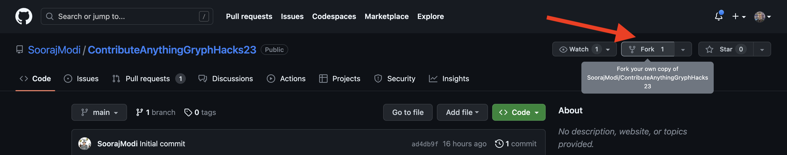
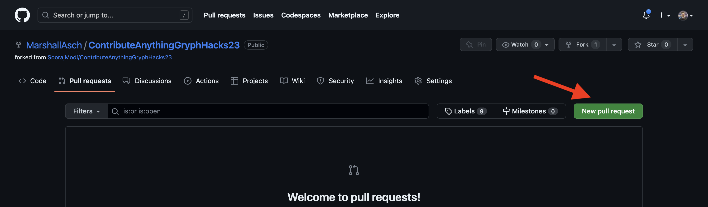
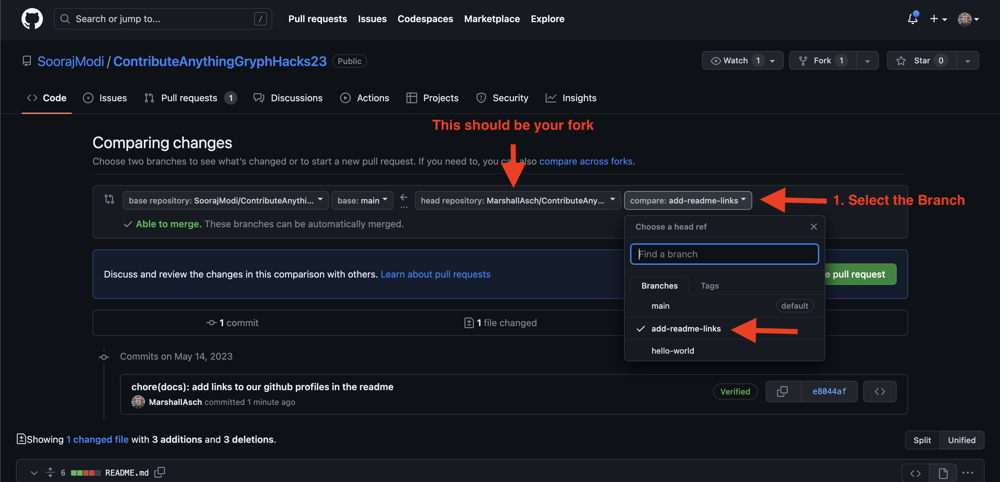
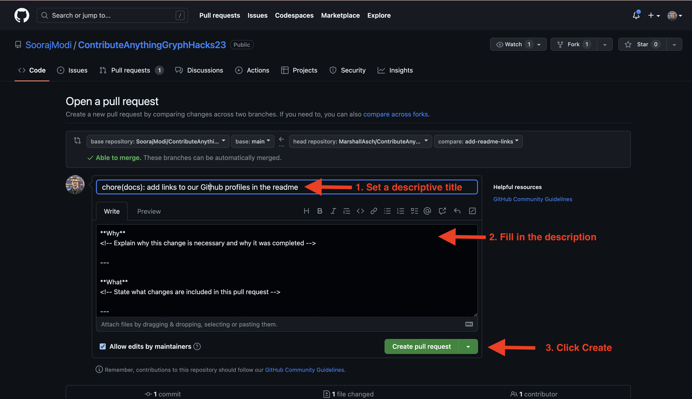
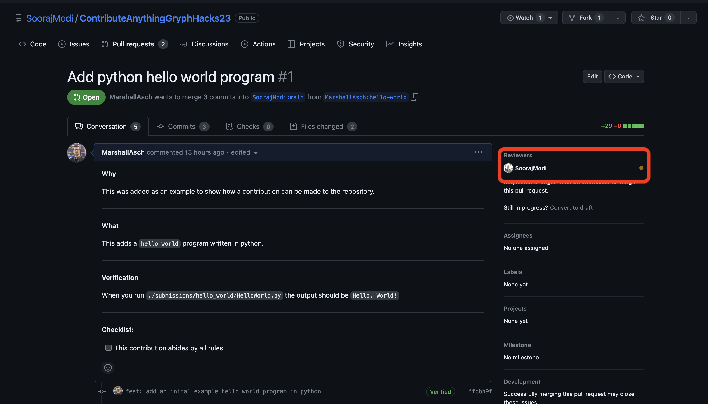
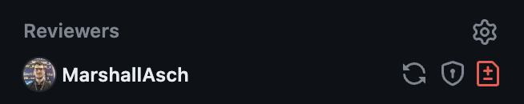
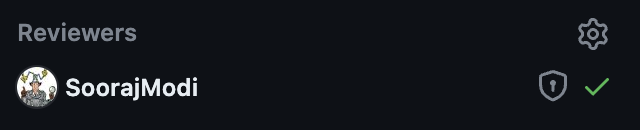
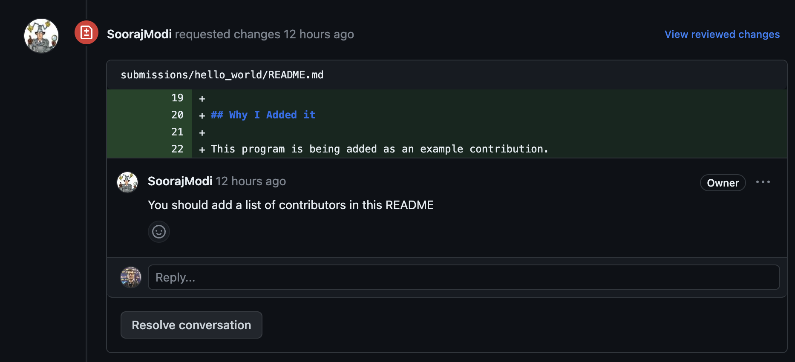
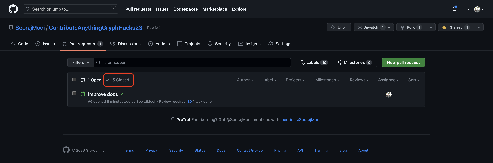
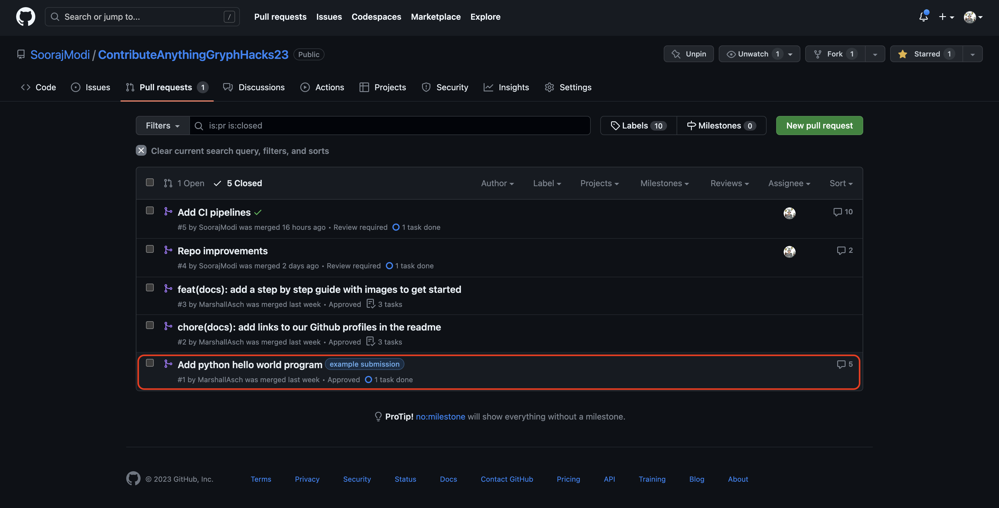

# Step-by-Step Instructions

1. Create a `fork` of the repository by clicking the fork button at the top right of the page.

2. Setup the new fork by selecting the Github account and name for the new repo.

3. `clone` the forked repository locally.

4. Add changes locally, stage and commit changes, push to the remote repository, and then you can create the Pull Request.

You can make the pull request by either clicking the pull request button from your fork, _or_ from the [pull request](https://github.com/SoorajModi/ContributeAnythingGryphHacks23/pulls) tab on the main repository and selecting the `compare across forks` option.

5. Once you select the branch that you are making a pull request from you will need to finish filling out its information.
Some will be partially filled out from the template.

This is what the newly created Pull Request should look like. It, will automatically assign reviewers, and it will show an orange circle indicator while it is awaiting a review.

After the Pull request has been reviewed the indicator will change to one of the following indicating that either some changes must be made, there are some comments, or it has been accepted.

If changes are requested there will be a comment indicating the file and line the change is being requested on and a description of the change.

All conversations must be resolved before the PR can be merged. You or the commenter can mark the conversation as resolved if the issue has been addressed.

6. Once your PR has been approved and all conversatins have been resolved, no additional steps will be required from you, a codeowner will merge your PR into main.

## Example submissions

You can find an example of a submission by going to the [pull requests section of the repo](https://github.com/SoorajModi/ContributeAnythingGryphHacks23/pulls). Go to the closed PRs:

Then select on any PRs with the tag `example submission`, or click on [this link](https://github.com/SoorajModi/ContributeAnythingGryphHacks23/pull/1) directly

